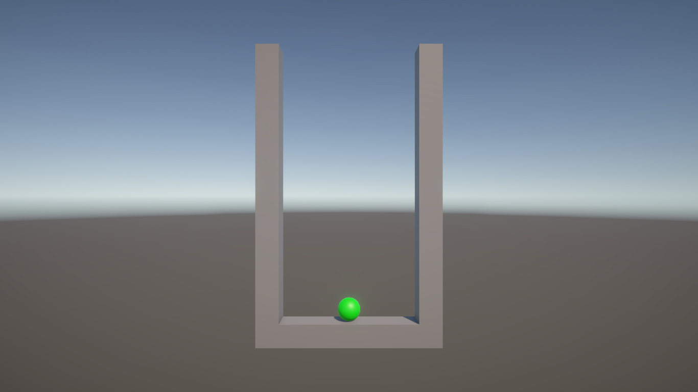
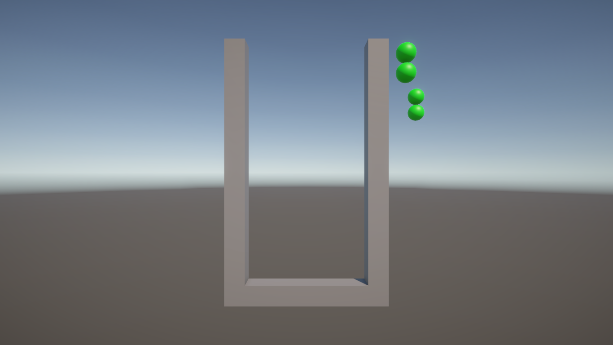
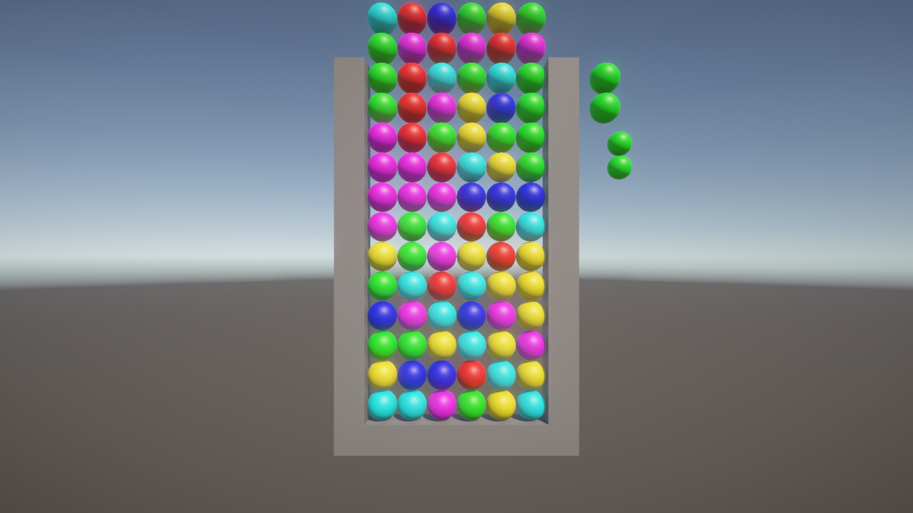

ぷよぷよは、現在では、[ぷよぷよプログラミング](https://puyo.sega.jp/program_2020/)でソースコードが公開されて、
手軽にプログラミングできるようになっています。

ぷよぷよプログラミングは、良い仕組みなのですが、正解があって、それを写経する仕組みになっています。
それはそれでよいのですが、もう少し、ゲームを少しずつ作れないかなぁと思いました。

ということで、ここではまっさらな状態から、だんだんとゲームを作っていこうと思います。

ぷよぷよプログラミングのコードを見ないで作っているので、微妙に処理が違っていると思いますが、その点はごめんなさい。

# 各ステップ

## 1. 仮想空間にオブジェクトを置いてみる

## 2. 動かすキャラクターを置く

## 3. 盤面をモデル化する

## 4. 左右移動

<video src="https://user-images.githubusercontent.com/936545/155824085-2426c928-6faf-4c8d-9627-8e74e8992b76.mp4" controls="controls" style="max-width: 100%;"></video>

## 5. 回転

<video src="https://user-images.githubusercontent.com/936545/155824493-863e47eb-75f6-4682-8d92-05b47fe7f5df.mp4" controls="controls" style="max-width: 100%;"></video>

## 6. アニメーションして動く

<video src="https://user-images.githubusercontent.com/936545/155825023-d2ec379d-8ce1-40a9-8131-c3ac43f4f866.mp4" controls="controls" style="max-width: 100%;"></video>

## 7. キー入力の加工

今回の結果は、前回と違いがありません。

## 8. 重力落下

<video src="https://user-images.githubusercontent.com/936545/155826203-08534a20-c7ec-482e-9e8a-fc33dbe2762b.mp4" controls="controls" style="max-width: 100%;"></video>

## 9. 次の色をランダムに決める

<video src="https://user-images.githubusercontent.com/936545/155825884-d5c6e4ae-dc41-4ed9-8770-cedcf61f5190.mp4" controls="controls" style="max-width: 100%;"></video>

## 10. ゲームの流れを作る

<video src="https://user-images.githubusercontent.com/936545/155826116-5ef255ec-5d9c-49f1-8b31-2a7c25045321.mp4" controls="controls" style="max-width: 100%;"></video>

## 11. 下に何もなければ落ちる

<video src="https://user-images.githubusercontent.com/936545/155828110-8f43b9f8-1fe4-4fd2-9933-8d8a227cc16c.mp4" controls="controls" style="max-width: 100%;"></video>

## 12. 4つ以上くっついたら消す

<video src="https://user-images.githubusercontent.com/936545/155828497-2a1c9ba8-1496-43e0-93d7-388f7fd400b1.mp4" controls="controls" style="max-width: 100%;"></video>

## 13. 得点を計算する

<video src="https://user-images.githubusercontent.com/936545/155828839-1bf1828b-32aa-4a93-b42c-c4eb390e2cb8.mp4" controls="controls" style="max-width: 100%;"></video>

## 14. タイトル画面を追加します

<video src="
" controls="controls" style="max-width: 100%;"></video>

